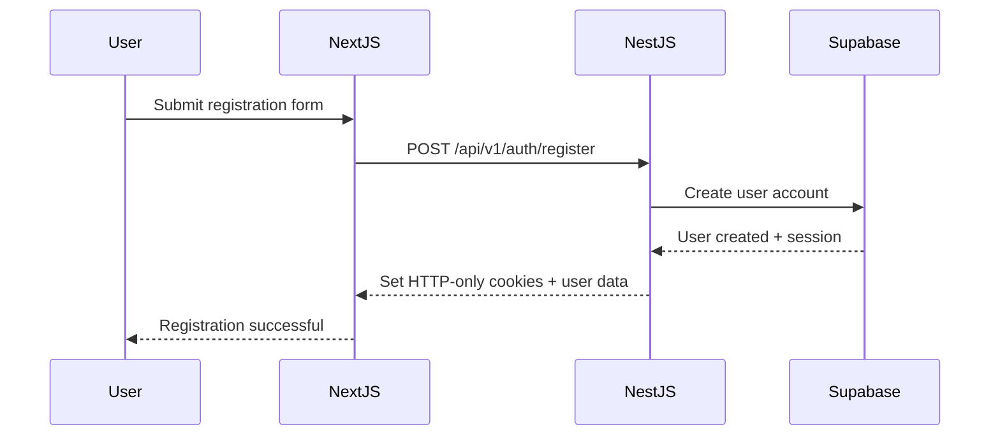
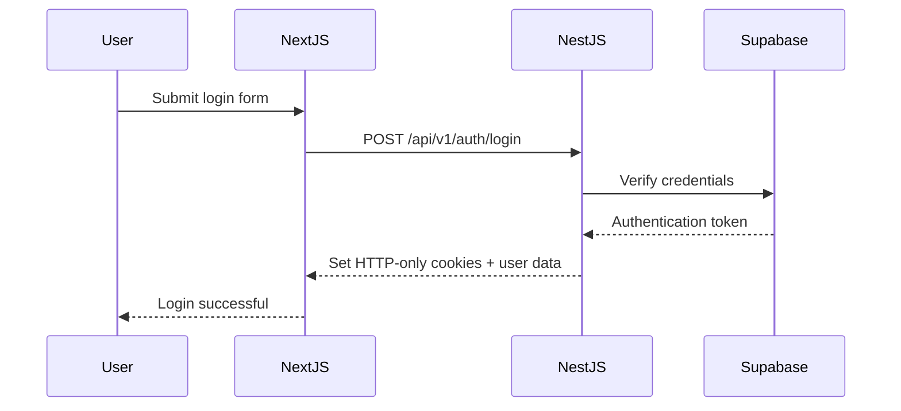
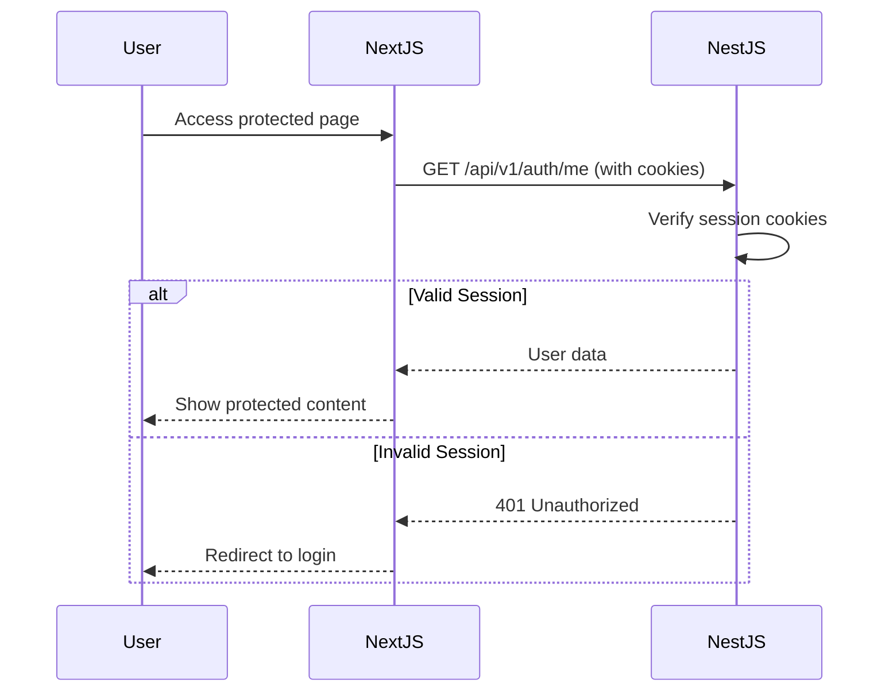

# Authentication Architecture

## Overview

The authentication system follows a clean architecture pattern where:
- **Frontend (Next.js)**: Only communicates with the NestJS backend API
- **Backend (NestJS)**: Handles all Supabase interactions and authentication logic
- **Supabase**: Used as an authentication service, completely abstracted from the frontend

## Architecture Diagram

```
┌─────────────────┐     ┌──────────────────┐     ┌─────────────────┐
│                 │     │                  │     │                 │
│   Next.js App   │────▶│  NestJS Backend  │────▶│    Supabase     │
│   (Frontend)    │◀────│     (API)        │◀────│  (Auth Service) │
│                 │     │                  │     │                 │
└─────────────────┘     └──────────────────┘     └─────────────────┘
     Cookies Only            Manages Auth           Hidden from UI
```

## Key Principles

1. **Single Source of Truth**: NestJS backend is the only authentication authority
2. **No Direct Supabase Access**: Frontend never directly communicates with Supabase
3. **Cookie-Based Sessions**: Authentication state managed via HTTP-only cookies
4. **Proxy Architecture**: All API calls go through Next.js proxy to maintain same domain

## Authentication Flow

### Registration


### Login


### Protected Route Access


## Implementation Details

### Frontend (Next.js)

#### AuthContext (`/src/contexts/AuthContext.tsx`)
- Manages authentication state in React
- Communicates only with NestJS API endpoints
- No Supabase imports or dependencies

#### API Client (`/src/lib/api-client.ts`)
- Handles all API requests with automatic cookie inclusion
- Uses relative URLs that are proxied to backend

#### Protected Routes
- Use `ProtectedRoute` component to check authentication
- Redirect to login if not authenticated

### Backend (NestJS)

#### Auth Module
- Handles all Supabase interactions
- Manages session cookies
- Provides authentication endpoints

#### Auth Guard
- Validates requests using HTTP-only cookies
- Automatically refreshes expired tokens
- Protects API endpoints

#### Supabase Service
- Encapsulates all Supabase SDK usage
- Handles user creation, login, and token management
- Never exposed to frontend

## Security Benefits

1. **No Token Exposure**: Tokens are never exposed to client-side JavaScript
2. **XSS Protection**: HTTP-only cookies prevent XSS attacks
3. **CSRF Protection**: Same-site cookies and proper CORS configuration
4. **Backend Validation**: All authentication logic happens server-side
5. **IP Hiding**: Backend server IP is hidden behind Next.js proxy

## Environment Configuration

### Frontend (.env.local)
```bash
# Only needs backend URL for proxy
BACKEND_URL=http://localhost:3001
```

### Backend (.env)
```bash
# Supabase configuration (only on backend)
SUPABASE_URL=your_supabase_url
SUPABASE_ANON_KEY=your_supabase_anon_key
SUPABASE_SERVICE_ROLE_KEY=your_supabase_service_role_key
```

## Best Practices

1. **Never expose Supabase credentials to frontend**
2. **Always use HTTP-only cookies for session management**
3. **Implement proper error handling in AuthContext**
4. **Use TypeScript interfaces for type safety**
5. **Keep authentication logic in the backend**

## Migration from Direct Supabase Usage

If migrating from direct Supabase usage in frontend:

1. Remove all Supabase packages from frontend
2. Remove Supabase client initialization
3. Update all auth calls to use NestJS API
4. Remove any Supabase-specific middleware
5. Test all authentication flows thoroughly